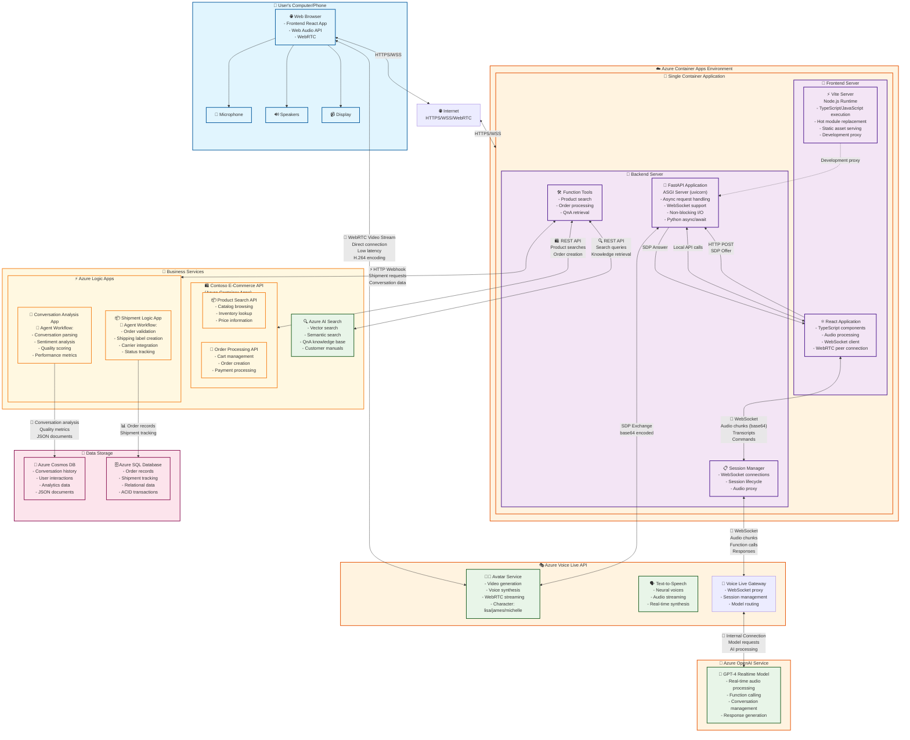

# Retail E-Com Voice Live Agent with Avatar

This solution extends the original Chainlit + Python prototype by splitting the workload into a Python backend and a TypeScript browser client. The backend keeps the Azure Voice Live realtime session (including all tool calls) while the browser attaches to the avatar stream through WebRTC.

## Comprehensive Solution Architecture

> **📋 How to View the Diagram:**
> - **VS Code**: Open this README.md and use `Ctrl+Shift+V` (Windows) or `Cmd+Shift+V` (Mac) to open Markdown Preview
> - **GitHub**: The Mermaid diagram will render automatically when viewing this file
> - **Alternative**: Scroll down for ASCII version if Mermaid doesn't render



### Alternative ASCII Architecture Diagram

```
┌─────────────────────────────────────────────────────────────────────────────────────────┐
│                           👤 USER'S COMPUTER/PHONE                                      │
│  ┌─────────────────────────────────────────────────────────────────────────────────┐   │
│  │  🌐 Web Browser                                                                  │   │
│  │  ├─ 📱 Frontend React App (TypeScript/JavaScript)                               │   │
│  │  ├─ 🎤 Web Audio API (Microphone capture)                                       │   │
│  │  ├─ 🔊 Web Audio API (Speaker output)                                           │   │
│  │  └─ 🎥 WebRTC (Direct video connection)                                         │   │
│  └─────────────────────────────────────────────────────────────────────────────────┘   │
└─────────────────────────────────────────────────────────────────────────────────────────┘
                                          │
                                    🌐 INTERNET
                                (HTTPS/WSS/WebRTC)
                                          │
┌─────────────────────────────────────────────────────────────────────────────────────────┐
│                        ☁️ AZURE CONTAINER APPS ENVIRONMENT                              │
│  ┌─────────────────────────────────────────────────────────────────────────────────┐   │
│  │                       🐳 SINGLE CONTAINER APPLICATION                           │   │
│  │  ┌─────────────────────────────┐  ┌─────────────────────────────────────────┐   │   │
│  │  │     📱 FRONTEND SERVER      │  │          🐍 BACKEND SERVER              │   │   │
│  │  │                             │  │                                         │   │   │
│  │  │ ⚡ Vite Server              │  │ 🚀 FastAPI Application                  │   │   │
│  │  │ - Node.js Runtime           │  │ - ASGI Server (uvicorn)                 │   │   │
│  │  │ - TypeScript/JavaScript     │  │ - Async request handling                │   │   │
│  │  │ - Hot module replacement    │  │ - WebSocket support                     │   │   │
│  │  │ - Development proxy         │  │ - Python async/await                    │   │   │
│  │  │                             │  │                                         │   │   │
│  │  │ ⚛️ React Application        │◄─┤ 📋 Session Manager                     │   │   │
│  │  │ - Audio processing          │  │ - WebSocket connections                 │   │   │
│  │  │ - WebSocket client          │  │ - Session lifecycle                     │   │   │
│  │  │ - WebRTC peer connection    │  │ - Audio proxy                           │   │   │
│  │  │                             │  │                                         │   │   │
│  │  └─────────────────────────────┘  │ 🛠️ Function Tools                      │   │   │
│  │               │                    │ - Product search                        │   │   │
│  │               │ Local API calls    │ - Order processing                      │   │   │
│  │               │ WebSocket          │ - QnA retrieval                         │   │   │
│  │               └────────────────────┴─────────────────────────────────────────┘   │   │
│  └─────────────────────────────────────────────────────────────────────────────────┘   │
└─────────────────────────────────────────────────────────────────────────────────────────┘
                                          │
                                    📡 WebSocket
                                  (Audio + Control)
                                          │
                                          ▼
┌─────────────────────────────────────────────────────────────────────────────────────────┐
│                            🧠 AZURE OPENAI SERVICE                                      │
│  ┌─────────────────────────────────────────────────────────────────────────────────┐   │
│  │                    🤖 GPT-4 Realtime Model                                     │   │
│  │  - Real-time audio processing    - Function calling                            │   │
│  │  - Conversation management       - Response generation                         │   │
│  └─────────────────────────────────────────────────────────────────────────────────┘   │
└─────────────────────────────────────────────────────────────────────────────────────────┘
                                          │
                                    Function Calls
                                          │
                                          ▼
┌─────────────────────────────────────────────────────────────────────────────────────────┐
│                         🎭 AZURE VOICE LIVE API                                         │
│  ┌─────────────────────────────────────────────────────────────────────────────────┐   │
│  │     👨‍💼 Avatar Service               🗣️ Text-to-Speech                        │   │
│  │     - Video generation                - Neural voices                           │   │
│  │     - WebRTC streaming               - Audio streaming                          │   │
│  │     - Characters: lisa/james         - Real-time synthesis                     │   │
│  └─────────────────────────────────────────────────────────────────────────────────┘   │
└─────────────────────────────────────────────────────────────────────────────────────────┘
                        │                                    ▲
                        │ 🎥 WebRTC Video Stream             │
                        │ (DIRECT CONNECTION)                │ SDP Negotiation
                        │ Low latency, H.264                 │ (via FastAPI)
                        ▼                                    │
               ┌─────────────────┐                          │
               │  👤 USER BROWSER │──────────────────────────┘
               │  Direct Video    │
               └─────────────────┘

┌─────────────────────────────────────────────────────────────────────────────────────────┐
│                           🏢 BUSINESS SERVICES LAYER                                    │
│                                                                                         │
│  ┌─────────────────────────┐  ┌─────────────────────────┐  ┌─────────────────────────┐ │
│  │  🛍️ CONTOSO E-COMMERCE │  │    ⚡ AZURE LOGIC APPS  │  │   🔍 AZURE AI SEARCH   │ │
│  │      (Container Apps)    │  │                         │  │                         │ │
│  │                         │  │  📦 Shipment Agent:     │  │ - Vector search         │ │
│  │ 📦 Product Search API   │  │  🤖 Intelligent Workflow │  │ - Semantic search       │ │
│  │ - Catalog browsing      │  │  - Order validation     │  │ - QnA knowledge base    │ │
│  │ - Inventory lookup      │  │  - Shipping labels      │  │ - Customer manuals      │ │
│  │ - Price information     │  │  - Carrier integration  │  │                         │ │
│  │                         │  │                         │  └─────────────────────────┘ │
│  │ 🛒 Order Processing API │  │  💬 Conversation Agent: │                              │
│  │ - Cart management       │  │  🤖 Analysis Workflow   │                              │
│  │ - Order creation        │  │  - Sentiment analysis   │                              │
│  │ - Payment processing    │  │  - Quality scoring      │                              │
│  └─────────────────────────┘  │  - Performance metrics  │                              │
│                               └─────────────────────────┘                              │
└─────────────────────────────────────────────────────────────────────────────────────────┘
                                          │
                                    Data Storage
                                          │
                                          ▼
┌─────────────────────────────────────────────────────────────────────────────────────────┐
│                              💾 DATA STORAGE LAYER                                      │
│                                                                                         │
│  ┌─────────────────────────────────────┐  ┌─────────────────────────────────────────┐ │
│  │        🌟 AZURE COSMOS DB           │  │         🗄️ AZURE SQL DATABASE         │ │
│  │                                     │  │                                         │ │
│  │ - Conversation history              │  │ - Order records                         │ │
│  │ - User interactions                 │  │ - Shipment tracking                     │ │
│  │ - Analytics data                    │  │ - Relational data                       │ │
│  │ - JSON documents                    │  │ - ACID transactions                     │ │
│  │ - Quality scores & analysis         │  │ - Normalized schemas                    │ │
│  └─────────────────────────────────────┘  └─────────────────────────────────────────┘ │
└─────────────────────────────────────────────────────────────────────────────────────────┘

KEY COMMUNICATION FLOWS:
══════════════════════════

🎵 AUDIO FLOW:
Browser → WebSocket → FastAPI → WebSocket → Azure Voice Live → GPT Realtime

🎥 VIDEO FLOW:
Browser ↔ WebRTC Direct Connection ↔ Azure Voice Live (bypasses backend for performance)

🔧 FUNCTION CALLS:
GPT Realtime → FastAPI Tools → Business APIs → Response → GPT Realtime

🤖 INTELLIGENT AGENTS:
- Shipment Logic App: Analyzes orders, validates, creates shipping, tracks status
- Conversation Analysis: Reviews conversations, sentiment analysis, quality scoring
```

### Architecture Components Explained

#### 🐳 Container Application Architecture
- **Vite Server**: Node.js-based development server that serves the React application. In development, it provides hot module replacement and proxies API calls to FastAPI. In production, the React app is built into static files served by FastAPI.
- **FastAPI with ASGI**: Python web framework running on uvicorn ASGI server. ASGI (Asynchronous Server Gateway Interface) enables handling multiple concurrent connections efficiently, crucial for WebSocket connections and real-time audio processing.

#### 🤖 AI & Voice Services Integration
- **Azure Voice Live API**: Primary service that manages the connection to GPT-4 Realtime Model, provides avatar video generation, neural text-to-speech, and WebSocket gateway functionality
- **GPT-4 Realtime Model**: Accessed through Azure Voice Live API for real-time audio processing, function calling, and intelligent conversation management

#### 🔄 Communication Flows
1. **Audio Flow**: Browser → WebSocket → FastAPI → WebSocket → Azure Voice Live API → GPT-4 Realtime Model
2. **Video Flow**: Browser ↔ WebRTC Direct Connection ↔ Azure Voice Live API (bypasses backend for performance)
3. **Function Calls**: GPT-4 Realtime (via Voice Live) → FastAPI Tools → Business APIs → Response → GPT-4 Realtime (via Voice Live)

#### 🤖 Intelligent Agent Workflows
- **Shipment Logic App Agent**: Analyzes orders, validates data, creates shipping labels, and updates tracking information
- **Conversation Analysis Agent**: Reviews complete conversations, performs sentiment analysis, generates quality scores with justification, and stores insights for continuous improvement

## Architecture Overview

This application implements a **hybrid architecture** using both **WebSocket proxying** and **direct WebRTC connections** for optimal performance and centralized control.

### Key Components

- **Frontend (`frontend/`)** – Vite + React client that captures user audio, streams PCM chunks to the backend over WebSocket, renders assistant audio locally, and establishes direct WebRTC connections for avatar video streaming.
- **Backend (`backend/`)** – FastAPI service that acts as a WebSocket proxy between the frontend and Azure Voice Live API, manages sessions, handles function calls, and facilitates WebRTC SDP negotiation for avatar connections.
- **Azure Voice Live API** – Microsoft's realtime AI service that processes audio, generates responses, and provides avatar video streams via WebRTC.

### Communication Architecture

The application uses **three distinct communication flows**:

#### 1. Audio & Control Flow (WebSocket Proxy)
```
┌─────────────┐    WebSocket     ┌─────────────┐    WebSocket     ┌─────────────────┐
│             │◄────────────────►│             │◄────────────────►│                 │
│  Frontend   │   Audio Chunks   │   FastAPI   │   Audio Chunks   │  Azure Voice    │
│  (React)    │   Transcripts    │   Backend   │   Transcripts    │   Live API      │
│             │   Commands       │   (Proxy)   │   Commands       │                 │
└─────────────┘                  └─────────────┘                  └─────────────────┘
```

#### 2. Avatar Video Flow (Direct WebRTC)
```
┌─────────────┐                                                   ┌─────────────────┐
│             │                                                   │                 │
│  Frontend   │◄─────────────── WebRTC Video Stream ─────────────►│  Azure Voice    │
│  (React)    │                 (Direct Connection)               │   Live API      │
│             │                                                   │                 │
└─────────────┘                                                   └─────────────────┘
       ▲                                                                   ▲
       │                                                                   │
       │             ┌──────────────┐                                      │
       └────────────►│   FastAPI    │──────────────────────────────────────┘
         SDP Offer   │   Backend    │              SDP Answer
         (HTTP POST) │ (SDP Broker) │            (HTTP Response)
                     └──────────────┘
```

#### 3. Function Calls & Business Logic Flow
```
┌─────────────┐    WebSocket     ┌─────────────┐    HTTP/REST     ┌─────────────────┐
│             │◄────────────────►│             │◄────────────────►│                 │
│  Frontend   │   Function Call  │   FastAPI   │   Search Queries │  Azure AI       │
│  (Display)  │   Results        │   Backend   │   E-com APIs     │  Search /       │
│             │                  │ (Executor)  │   Logic Apps     │  Business APIs  │
└─────────────┘                  └─────────────┘                  └─────────────────┘
```

### Detailed Flow Breakdown

#### Audio Processing Flow
1. **Microphone Capture**: Frontend captures audio using Web Audio API
2. **Audio Processing**: Downsamples audio to 24kHz, converts to base64
3. **WebSocket Transmission**: Sends audio chunks to FastAPI backend via WebSocket
4. **Proxy Relay**: Backend forwards audio to Azure Voice Live API via separate WebSocket
5. **Response Processing**: Azure sends back audio deltas, transcripts, and commands
6. **Response Relay**: Backend forwards responses back to frontend via WebSocket
7. **Audio Playback**: Frontend schedules audio playback using Web Audio API

#### Avatar Video Flow
1. **WebRTC Initialization**: Frontend creates RTCPeerConnection when "Start Avatar" is clicked
2. **SDP Offer Creation**: Frontend generates WebRTC offer with audio/video transceivers
3. **SDP Negotiation**: FastAPI backend acts as SDP broker:
   - Receives SDP offer via HTTP POST
   - Encodes offer as base64 JSON and sends to Azure Voice Live
   - Receives SDP answer from Azure Voice Live
   - Decodes and returns SDP answer to frontend
4. **Direct Connection**: Frontend establishes direct WebRTC connection to Azure Voice Live
5. **Video Streaming**: Avatar video streams directly from Azure to browser (bypassing backend)
6. **ICE Server Configuration**: Backend provides TURN/STUN servers via WebSocket for NAT traversal

#### Function Call Processing
1. **AI Decision**: Azure Voice Live determines when to call functions based on conversation
2. **Function Execution**: Backend receives function calls and executes them:
   - Azure AI Search for knowledge queries
   - E-commerce APIs for product searches and orders
   - Logic Apps for shipments and call logging
3. **Result Return**: Backend sends function results back to Azure Voice Live
4. **Response Generation**: Azure Voice Live incorporates results into conversational response

### Why This Hybrid Architecture?

This design provides the **best of both worlds**:

#### WebSocket Proxy Benefits:
- **Centralized Authentication**: Backend manages Azure credentials securely
- **Request Logging**: All interactions can be logged and monitored
- **Function Call Handling**: Business logic stays server-side
- **Connection Management**: Backend handles connection resilience and retries
- **CORS Avoidance**: No cross-origin issues for API calls

#### Direct WebRTC Benefits:
- **Low Latency**: Video streams directly without proxy overhead
- **High Quality**: No compression or re-encoding of video stream
- **Browser Optimization**: Leverages browser's native WebRTC optimizations
- **Bandwidth Efficiency**: Avoids double bandwidth usage through proxy

#### Security Model:
- **Frontend**: No direct Azure credentials, communicates only with trusted backend
- **Backend**: Holds all Azure credentials, validates all requests
- **WebRTC**: Secured via ICE/DTLS, SDP negotiation controlled by backend

## Technical Implementation Details

### WebSocket Implementation

#### Frontend WebSocket (`App.tsx`)
The frontend establishes a WebSocket connection to the FastAPI backend:

```typescript
// WebSocket connection to backend
const ws = new WebSocket(`${BACKEND_WS_BASE}/ws/sessions/${id}`);

// Sending audio chunks
ws.send(JSON.stringify({
    type: "audio_chunk",
    data: base64AudioData,
    encoding: "float32",
}));

// Receiving responses
ws.onmessage = (msg) => {
    const data = JSON.parse(msg.data);
    switch (data.type) {
        case "assistant_audio_delta":
            schedulePlayback(data.delta); // Play audio via Web Audio API
            break;
        case "assistant_transcript_delta":
            setAssistantTranscript(prev => prev + data.delta);
            break;
        case "event":
            // Handle ICE servers and other session events
            break;
    }
};
```

#### Backend WebSocket Proxy (`voice_live_client.py`)
The backend maintains a separate WebSocket connection to Azure Voice Live:

```python
# Connection to Azure Voice Live API
self.ws = await websockets.connect(ws_url, additional_headers=headers)

# Forwarding audio from frontend to Azure
await self._send("input_audio_buffer.append", {"audio": pcm_b64})

# Broadcasting Azure responses to frontend
async def _broadcast(self, event: Dict[str, Any]) -> None:
    for queue in list(self._listeners):
        queue.put_nowait(event)  # Send to all connected frontends
```

### WebRTC Implementation

#### SDP Exchange Process
The WebRTC connection for avatar video requires a careful SDP exchange:

```typescript
// Frontend: Create WebRTC offer
const pc = new RTCPeerConnection({
    bundlePolicy: "max-bundle",
    iceServers: avatarIceServers, // Received via WebSocket from Azure
});

pc.addTransceiver("audio", { direction: "recvonly" });
pc.addTransceiver("video", { direction: "recvonly" });

const offer = await pc.createOffer();
await pc.setLocalDescription(offer);

// Send SDP offer to backend via HTTP
const response = await fetch(`/sessions/${sessionId}/avatar-offer`, {
    method: "POST",
    body: JSON.stringify({ sdp: localSdp }),
});

const { sdp } = await response.json();
await pc.setRemoteDescription({ type: "answer", sdp });
```

```python
# Backend: SDP broker implementation
async def connect_avatar(self, client_sdp: str) -> str:
    # Encode SDP as required by Azure Voice Live
    encoded_sdp = self._encode_client_sdp(client_sdp)
    
    # Send to Azure Voice Live
    await self._send("session.avatar.connect", {
        "client_sdp": encoded_sdp,
        "rtc_configuration": {"bundle_policy": "max-bundle"},
    })
    
    # Wait for Azure's SDP answer
    server_sdp = await asyncio.wait_for(future, timeout=20)
    return server_sdp

@staticmethod
def _encode_client_sdp(client_sdp: str) -> str:
    payload = json.dumps({"type": "offer", "sdp": client_sdp})
    return base64.b64encode(payload.encode("utf-8")).decode("ascii")
```

#### Video Stream Handling
Once WebRTC is established, video streams directly to the browser:

```typescript
pc.ontrack = (event) => {
    const [stream] = event.streams;
    
    if (event.track.kind === "video" && videoRef.current) {
        videoRef.current.srcObject = stream; // Direct video rendering
        videoRef.current.play();
    }
    
    if (event.track.kind === "audio") {
        // Create hidden audio element for WebRTC audio
        const audioEl = document.createElement("audio");
        audioEl.srcObject = stream;
        audioEl.autoplay = true;
        document.body.appendChild(audioEl);
    }
};
```

### Audio Processing Pipeline

#### Microphone Capture and Processing
```typescript
// Capture microphone with Web Audio API
const mediaStream = await navigator.mediaDevices.getUserMedia({ audio: true });
const audioContext = new AudioContext();
const source = audioContext.createMediaStreamSource(mediaStream);
const processor = audioContext.createScriptProcessor(4096, 1, 1);

processor.onaudioprocess = (event) => {
    const input = event.inputBuffer.getChannelData(0);
    
    // Downsample to 24kHz for Azure Voice Live
    const downsampled = downsampleBuffer(input, audioContext.sampleRate, 24000);
    
    // Convert to base64 and send via WebSocket
    const base64 = float32ToBase64(downsampled);
    wsRef.current?.send(JSON.stringify({
        type: "audio_chunk",
        data: base64,
        encoding: "float32",
    }));
};
```

#### Assistant Audio Playback
```typescript
// Schedule assistant audio for seamless playback
const schedulePlayback = useCallback((deltaB64: string) => {
    const audioCtx = ensurePlaybackContext();
    const floatSamples = pcm16Base64ToFloat32(deltaB64);
    
    const buffer = audioCtx.createBuffer(1, floatSamples.length, 24000);
    buffer.copyToChannel(floatSamples, 0);
    
    const source = audioCtx.createBufferSource();
    source.buffer = buffer;
    source.connect(audioCtx.destination);
    
    // Schedule for seamless playback
    const startAt = Math.max(playbackCursor, audioCtx.currentTime + 0.02);
    source.start(startAt);
    playbackCursor = startAt + buffer.duration;
}, []);
```

### Session Management

#### Backend Session Lifecycle
```python
class SessionManager:
    def __init__(self):
        self._sessions: Dict[str, VoiceLiveSession] = {}
    
    async def create_session(self) -> VoiceLiveSession:
        session_id = str(uuid.uuid4())
        session = VoiceLiveSession(session_id)
        await session.connect()  # Connect to Azure Voice Live
        self._sessions[session_id] = session
        return session
    
    async def get_session(self, session_id: str) -> VoiceLiveSession:
        if session_id not in self._sessions:
            raise KeyError(f"Session {session_id} not found")
        return self._sessions[session_id]
```

#### Function Call Integration
```python
# Function calls are handled entirely in the backend
async def _handle_response_done(self, event: Dict[str, Any]) -> None:
    output_items = event.get("response", {}).get("output", [])
    first_item = output_items[0]
    
    if first_item.get("type") == "function_call":
        function_name = first_item.get("name")
        arguments = json.loads(first_item.get("arguments", "{}"))
        
        # Execute function (e.g., search products, create orders)
        func = AVAILABLE_FUNCTIONS.get(function_name)
        result = await loop.run_in_executor(None, lambda: func(**arguments))
        
        # Send result back to Azure Voice Live
        await self._send("conversation.item.create", {
            "item": {
                "type": "function_call_output",
                "call_id": call_id,
                "output": json.dumps(result),
            }
        })
        
        # Continue conversation
        await self._send("response.create", {"response": self._response_config})
```

### Connection States and Error Handling

#### WebSocket Resilience
```python
async def _ensure_connection(self) -> None:
    if not self._ws_is_open():
        await self.connect()
    if not self._ws_is_open():
        raise RuntimeError("Session websocket is not connected")
```

#### WebRTC Connection States
```typescript
// Monitor WebRTC connection state
pc.onconnectionstatechange = () => {
    switch (pc.connectionState) {
        case "connected":
            appendLog("Avatar connected");
            setAvatarReady(true);
            break;
        case "disconnected":
        case "failed":
            appendLog("Avatar connection failed");
            teardownAvatar();
            break;
    }
};
```

This technical implementation showcases how the hybrid architecture efficiently combines WebSocket proxying for control and audio, with direct WebRTC for high-performance video streaming.

## Prerequisites

- Python 3.10+
- Node.js 20+
- Azure resources:
  - Speech resource enabled for Voice Live API
  - Azure AI Search service (with an index + semantic configuration)
  - Logic Apps for shipments and call log analysis
  - Contoso retail sample APIs (or your equivalent business APIs)
- Authentication via either `DefaultAzureCredential` (Managed Identity, Visual Studio Code sign-in, or Azure CLI login) **or** an Azure OpenAI API key via `AZURE_OPENAI_API_KEY`.

## Configuration

Copy `.env.sample` to `.env` and fill in the required values:

```bash
cp .env.sample .env
```

Key settings:

- `AZURE_VOICE_LIVE_ENDPOINT` / `VOICE_LIVE_MODEL` – Voice Live endpoint + realtime model name (e.g. `gpt-realtime-preview`).
- `AZURE_VOICE_AVATAR_CHARACTER` – **Required**: Avatar persona that exists in your Speech Studio resource. 
  - **Find valid characters**: Go to [Speech Studio](https://speech.microsoft.com) → Your resource → Avatar section
  - **Region-specific**: Character names vary by Speech resource region
  - **Case-sensitive**: Use exact character ID from portal (e.g., `lisa`, `james`, `michelle`)
  - Common error: `avatar_verification_failed` means the character doesn't exist in your resource/region
- Optional `AZURE_VOICE_AVATAR_STYLE` – Supply only if the character supports named styles (leave unset to use the service default).
- `AZURE_OPENAI_API_KEY` – Required when authenticating with an API key instead of managed identity.
- `AZURE_VOICE_AVATAR_*` – Avatar character and optional TURN/STUN servers.
- `ai_search_*` – Azure AI Search connection settings.
- `logic_app_url_*` – Logic App webhook endpoints.
- `ecom_api_url` – Contoso sample API host.
- Optional `VITE_BACKEND_BASE` – Override when serving the frontend behind a different hostname.

## Running the Backend

```powershell
cd backend
python -m venv .venv
.venv\Scripts\activate
pip install -r requirements.txt
uvicorn app.main:app --host 0.0.0.0 --port 8000 --reload
```

The backend exposes:

- `POST /sessions` – Create a Voice Live session.
- `POST /sessions/{id}/avatar-offer` – Exchange WebRTC SDP for avatar video.
- `POST /sessions/{id}/text` – Send a text turn to the assistant.
- `POST /sessions/{id}/commit-audio` – Force audio commit (mostly for manual control).
- `WS /ws/sessions/{id}` – Bi-directional channel for audio streaming and realtime events.

## Running the Frontend

```powershell
cd frontend
npm install
npm run dev
```

The Vite dev server proxies API calls to `http://localhost:8000` (configure `vite.config.ts` if you deploy elsewhere).

### Browser Workflow

1. The app requests a new session from the backend and opens a WebSocket bridge.
2. Clicking **Start Microphone** captures audio, downsamples to 24 kHz float frames, and pushes base64 chunks to the backend.
3. Assistant audio deltas returned by the backend are scheduled in a browser `AudioContext` for playback.
4. Clicking **Start Avatar** creates a `RTCPeerConnection`, sends the SDP offer to `/avatar-offer`, and sets the returned answer. The avatar video and audio render through the `<video>` element.

## Tool Calling + Business Integrations

The backend reuses the original tools logic:

- `perform_search_based_qna` via Azure AI Search.
- Shipment and call log Logic App integrations.
- E-commerce catalog/order lookups via REST APIs.

Function call outputs are posted back to the realtime session so the model can continue the conversation seamlessly.

## Production Hardening Checklist

- Frontend worker for audio processing (AudioWorklet) to reduce latency.
- Persist conversation state for call log analysis payloads.
- Add authentication between browser ↔ backend (Azure AD App Service auth or Entra ID).
- Use a TURN server for the avatar stream when operating across restrictive networks.
- Instrument backend with Application Insights for latency + error tracking.

## Avatar Functionality Deep Dive

The avatar functionality represents the most complex part of this application, involving a sophisticated handshake between WebSocket control messages and WebRTC media streaming.

### Avatar Architecture Flow

```
Frontend                 FastAPI Backend           Azure Voice Live API
   │                          │                          │
   │ 1. Request Session       │                          │
   │─────────────────────────►│                          │
   │                          │ 2. Create Session        │
   │                          │─────────────────────────►│
   │                          │                          │
   │                          │ 3. Session Config        │
   │                          │    (with avatar settings)│
   │                          │─────────────────────────►│
   │                          │                          │
   │                          │ 4. session.updated       │
   │                          │    (ICE servers)         │
   │ 5. ICE servers           │◄─────────────────────────│
   │◄─────────────────────────│                          │
   │                          │                          │
   │ 6. Click "Start Avatar"  │                          │
   │                          │                          │
   │ 7. Create RTCPeerConn    │                          │
   │    with ICE servers      │                          │
   │                          │                          │
   │ 8. Generate SDP Offer    │                          │
   │                          │                          │
   │ 9. POST /avatar-offer    │                          │
   │─────────────────────────►│                          │
   │                          │ 10. Encode & Send SDP    │
   │                          │─────────────────────────►│
   │                          │                          │
   │                          │ 11. session.avatar.      │
   │                          │     connecting           │
   │                          │     (SDP answer)         │
   │ 12. SDP Answer           │◄─────────────────────────│
   │◄─────────────────────────│                          │
   │                          │                          │
   │ 13. setRemoteDescription │                          │
   │                          │                          │
   │ 14. WebRTC Handshake     │                          │
   │◄─────────────────────────┼─────────────────────────►│
   │    (Direct Connection)   │                          │
   │                          │                          │
   │ 15. Video/Audio Stream   │                          │
   │◄─────────────────────────────────────────────────────│
   │    (Bypasses Backend)    │                          │
```

### Backend Implementation Details

#### Session Configuration for Avatar
The backend configures the Voice Live session to enable avatar functionality:

```python
def _build_avatar_config(self) -> Dict[str, Any]:
    character = os.getenv("AZURE_VOICE_AVATAR_CHARACTER", "lisa")
    style = os.getenv("AZURE_VOICE_AVATAR_STYLE")
    video_width = int(os.getenv("AZURE_VOICE_AVATAR_WIDTH", "1280"))
    video_height = int(os.getenv("AZURE_VOICE_AVATAR_HEIGHT", "720"))
    bitrate = int(os.getenv("AZURE_VOICE_AVATAR_BITRATE", "2000000"))
    
    config = {
        "character": character,
        "customized": False,
        "video": {
            "resolution": {"width": video_width, "height": video_height}, 
            "bitrate": bitrate
        },
    }
    
    # Optional style configuration
    if style:
        config["style"] = style
    
    # ICE server configuration for NAT traversal
    ice_urls = os.getenv("AZURE_VOICE_AVATAR_ICE_URLS")
    if ice_urls:
        config["ice_servers"] = [
            {"urls": [url.strip() for url in ice_urls.split(",") if url.strip()]}
        ]
    
    return config

# Session configuration includes avatar modality
self._session_config = {
    "modalities": ["text", "audio", "avatar", "animation"],
    "avatar": self._build_avatar_config(),
    "animation": {"model_name": "default", "outputs": ["blendshapes", "viseme_id"]},
    # ... other config
}
```

#### SDP Encoding and Decoding
Azure Voice Live requires specific SDP formatting:

```python
@staticmethod
def _encode_client_sdp(client_sdp: str) -> str:
    """Encode SDP offer as base64 JSON as required by Azure Voice Live"""
    payload = json.dumps({"type": "offer", "sdp": client_sdp})
    return base64.b64encode(payload.encode("utf-8")).decode("ascii")

@staticmethod
def _decode_server_sdp(server_sdp_raw: Optional[str]) -> Optional[str]:
    """Decode SDP answer from Azure Voice Live"""
    if not server_sdp_raw:
        return None
    
    # Handle both plain SDP and base64-encoded JSON
    if server_sdp_raw.startswith("v=0"):
        return server_sdp_raw
    
    try:
        decoded_bytes = base64.b64decode(server_sdp_raw)
        decoded_text = decoded_bytes.decode("utf-8")
        payload = json.loads(decoded_text)
        
        if isinstance(payload, dict):
            return payload.get("sdp")
        return decoded_text
    except Exception:
        return server_sdp_raw
```

#### Avatar Connection Handler
```python
async def connect_avatar(self, client_sdp: str) -> str:
    """Handle WebRTC SDP negotiation for avatar connection"""
    await self._connected_event.wait()
    await self._ensure_connection()
    
    # Create future to wait for Azure's SDP answer
    future: asyncio.Future = asyncio.get_event_loop().create_future()
    self._avatar_future = future
    
    # Encode and send SDP offer to Azure
    encoded_sdp = self._encode_client_sdp(client_sdp)
    payload = {
        "client_sdp": encoded_sdp,
        "rtc_configuration": {"bundle_policy": "max-bundle"},
    }
    
    await self._send("session.avatar.connect", payload)
    
    try:
        # Wait for SDP answer with timeout
        server_sdp = await asyncio.wait_for(future, timeout=20)
        return server_sdp
    finally:
        self._avatar_future = None
```

### Frontend Implementation Details

#### ICE Server Management
The frontend captures ICE servers from Azure via WebSocket:

```typescript
// Capture ICE servers from session.updated events
case "event": {
    const payload = data.payload as Record<string, any>;
    if (payload?.type === "session.updated") {
        const session = payload.session ?? {};
        const avatar = session.avatar ?? {};
        
        // Look for ICE servers in multiple locations
        const candidateSources = [
            avatar.ice_servers,
            session.rtc?.ice_servers,
            session.ice_servers,
        ].find((value) => Array.isArray(value));
        
        if (candidateSources) {
            const normalized: RTCIceServer[] = candidateSources
                .map((entry: any) => {
                    if (typeof entry === "string") {
                        return { urls: entry };
                    }
                    if (entry && typeof entry === "object") {
                        const { urls, username, credential } = entry;
                        return urls ? { urls, username, credential } : null;
                    }
                    return null;
                })
                .filter((entry): entry is RTCIceServer => Boolean(entry));
            
            setAvatarIceServers(normalized);
        }
    }
    break;
}
```

#### WebRTC Connection Setup
```typescript
const startAvatar = useCallback(async () => {
    if (!sessionId || pcRef.current) return;
    
    setAvatarLoading(true);
    
    try {
        // Create RTCPeerConnection with ICE servers from Azure
        const pc = new RTCPeerConnection({
            bundlePolicy: "max-bundle",
            iceServers: avatarIceServers,
        });
        pcRef.current = pc;
        
        // Add receive-only transceivers for avatar stream
        pc.addTransceiver("audio", { direction: "recvonly" });
        pc.addTransceiver("video", { direction: "recvonly" });
        
        // Handle incoming tracks
        pc.ontrack = (event) => {
            const [stream] = event.streams;
            if (!stream) return;
            
            if (event.track.kind === "video" && videoRef.current) {
                videoRef.current.srcObject = stream;
                videoRef.current.play().catch(() => {});
                appendLog("Avatar video track received");
            }
            
            if (event.track.kind === "audio") {
                // Create hidden audio element for WebRTC audio
                let audioEl = remoteAudioRef.current;
                if (!audioEl) {
                    audioEl = document.createElement("audio");
                    audioEl.autoplay = true;
                    audioEl.controls = false;
                    audioEl.style.display = "none";
                    audioEl.muted = false;
                    document.body.appendChild(audioEl);
                    remoteAudioRef.current = audioEl;
                }
                audioEl.srcObject = stream;
                audioEl.play().catch(() => undefined);
                appendLog("Avatar audio track received");
            }
        };
        
        // Wait for ICE gathering to complete
        const gatheringFinished = new Promise<void>((resolve) => {
            if (pc.iceGatheringState === "complete") {
                resolve();
            } else {
                pc.addEventListener("icegatheringstatechange", () => {
                    if (pc.iceGatheringState === "complete") {
                        resolve();
                    }
                });
            }
        });
        
        // Create and set local description
        const offer = await pc.createOffer();
        await pc.setLocalDescription(offer);
        await gatheringFinished;
        
        const localSdp = pc.localDescription?.sdp;
        if (!localSdp) {
            throw new Error("Failed to obtain local SDP");
        }
        
        // Send SDP offer to backend
        const response = await fetch(`${BACKEND_HTTP_BASE}/sessions/${sessionId}/avatar-offer`, {
            method: "POST",
            headers: { "Content-Type": "application/json" },
            body: JSON.stringify({ sdp: localSdp }),
        });
        
        if (!response.ok) {
            throw new Error(`Avatar offer failed: ${response.status}`);
        }
        
        // Set remote description with Azure's SDP answer
        const { sdp } = await response.json();
        await pc.setRemoteDescription({ type: "answer", sdp });
        
        setAvatarLoading(false);
        setAvatarReady(true);
        appendLog("Avatar connected");
        
    } catch (error) {
        appendLog(`Avatar connection error: ${String(error)}`);
        setAvatarLoading(false);
        teardownAvatar();
    }
}, [sessionId, avatarIceServers]);
```

### Audio Context Coordination

One critical aspect is coordinating between WebRTC audio (from avatar) and Web Audio API (for assistant responses):

```typescript
const ensurePlaybackContext = useCallback(() => {
    if (!playbackCtxRef.current) {
        playbackCtxRef.current = new AudioContext({ sampleRate: 24000 });
    }
    
    const ctx = playbackCtxRef.current;
    if (ctx?.state === "suspended") {
        ctx.resume().catch(() => undefined);
    }
    
    return playbackCtxRef.current;
}, []);

// When starting microphone, also ensure playback context is ready
const startMic = useCallback(async () => {
    const mediaStream = await navigator.mediaDevices.getUserMedia({ audio: true });
    const audioContext = new AudioContext();
    
    // Resume both capture and playback contexts
    if (audioContext.state === "suspended") {
        await audioContext.resume();
    }
    
    const playbackCtx = ensurePlaybackContext();
    if (playbackCtx && playbackCtx.state === "suspended") {
        await playbackCtx.resume();
    }
    
    // ... rest of microphone setup
}, [ensurePlaybackContext]);
```

### Session Events to Expect

1. **`session.updated`** – Confirms avatar modality is active and provides ICE servers
2. **`session.avatar.connecting`** – Avatar WebRTC handshake in progress  
3. **`response.audio.delta`** – Assistant audio continues even with avatar active
4. **WebRTC `ontrack`** – Video and audio tracks received from avatar
5. **`error`** – Any negotiation or streaming failures

### Troubleshooting Avatar Issues

#### Common Error Patterns
```typescript
// Monitor WebRTC connection state
pc.onconnectionstatechange = () => {
    appendLog(`WebRTC state: ${pc.connectionState}`);
    switch (pc.connectionState) {
        case "failed":
            appendLog("WebRTC connection failed - check ICE servers");
            break;
        case "disconnected":
            appendLog("WebRTC disconnected - attempting reconnection");
            break;
    }
};

// Monitor ICE connection state  
pc.oniceconnectionstatechange = () => {
    appendLog(`ICE state: ${pc.iceConnectionState}`);
    if (pc.iceConnectionState === "failed") {
        appendLog("ICE connection failed - check network/TURN servers");
    }
};
```

#### Validation Tools
Use the provided test script to validate avatar configuration:

```bash
cd backend
python test_avatar_characters.py
```

This script performs the same SDP exchange as the production client and helps identify configuration issues.

The avatar path relies on the Azure Voice Live realtime session plus a WebRTC negotiation with the browser. The following steps capture the exact code changes that enabled a reliable avatar stream.

### Backend (`backend/app/voice_live_client.py`)

- **Session configuration** – `VoiceLiveSession._session_config` enables `"avatar"` and `"animation"` modalities and injects `AZURE_VOICE_AVATAR_*` settings produced from `_build_avatar_config()`.
- **Session update** – On connect, the backend immediately sends `session.update` with the avatar block so the service returns ICE server hints in subsequent `session.updated` events.
- **SDP encoding** – `connect_avatar` wraps the browser SDP as `{"type": "offer", "sdp": ...}` and base64-encodes it. This matches the Voice Live requirement (the API rejects plain-text SDP).
- **session.avatar.connecting** – When the service responds the backend decodes the `server_sdp` (base64 JSON payload) and resolves a future so `/avatar-offer` can reply with a clean SDP answer.
- **Event fan-out** – Every raw event from the Azure websocket is broadcast to browser listeners. This is how the frontend receives `session.updated` (for ICE servers) and `session.avatar.connecting` (for UI state).

### Frontend (`frontend/src/App.tsx`)

- **Capture ICE servers** – The websocket handler watches for `event.type === "session.updated"`, normalises any `ice_servers` blocks, and stores them in React state.
- **WebRTC offer** – `startAvatar()` builds an `RTCPeerConnection` with `bundlePolicy: "max-bundle"`, adds `recvonly` audio/video transceivers, and uses the cached ICE server list when available.
- **SDP exchange** – The local offer is posted to `/sessions/{id}/avatar-offer`; the decoded SDP answer returned by the backend is applied as the remote description.
- **Track handling** – `pc.ontrack` splits audio vs. video. Video streams bind directly to the `<video>` element, while audio streams attach to a hidden `<audio>` element that auto-plays to avoid browser autoplay restrictions.
- **Audio context unlock** – Starting the microphone resumes both the capture `AudioContext` and the playback `AudioContext`, ensuring mixed PCM deltas and WebRTC audio play through the same output device.

### Session Events to Expect

1. `session.updated` – Confirms the avatar modality is active and carries TURN/STUN server configuration. The frontend must harvest these values before calling `startAvatar()`.
2. `session.avatar.connecting` – Indicates the realtime service accepted the SDP; backend responds with a decoded answer, which the frontend applies immediately.
3. `response.audio.delta` / `response.audio.done` – Continue to deliver PCM deltas even when the avatar is active. The frontend schedules these in an `AudioContext` so the audio output stays smooth while the WebRTC stream spins up.
4. `error` – Any negotiation failure is surfaced to the browser log. Typical causes include unknown avatar characters, missing ICE configuration, or malformed SDP payloads.

### Troubleshooting Tips

- Use the helper script `backend/test_avatar_characters.py` to validate character/style combinations. It performs the same base64 SDP exchange as the production client.
- A `session.avatar.connect` timeout usually means the backend never saw `session.avatar.connecting`; check that the SDP payload is base64 JSON and that `AZURE_VOICE_AVATAR_ENABLED=true`.
- If the video renders but audio is silent, confirm the `Avatar audio track received` log appears and the hidden `<audio>` element is attached in DevTools. Missing ICE servers or a suspended `AudioContext` are the most common causes.

## Deployment

This application supports both local development and production deployment to Azure Container Apps with zero workflow changes required.

### Local Development (No Changes Required)

The current local development workflow remains completely unchanged:

**Backend** (Terminal 1):
```bash
cd backend
uvicorn app.main:app --host 0.0.0.0 --port 8000 --reload
```

**Frontend** (Terminal 2):
```bash
cd frontend
npm run dev
```

**Access**: `http://localhost:5173`

### How Local Development Works
- **Frontend**: Vite dev server on `localhost:5173` with hot reloading
- **Backend**: FastAPI on `localhost:8000` via Uvicorn ASGI server
- **Communication**: Frontend uses proxy configuration in `vite.config.ts` to route API calls (`/sessions/*`, `/ws/*`) to the backend
- **Technology Stack**: React + Vite → FastAPI + Uvicorn (not Flask!)

### Azure Container Apps Deployment

For production deployment, both frontend and backend are packaged into a single container that serves everything from FastAPI on port 8000.

#### Architecture Changes for Production
- **Single Origin**: FastAPI serves both API endpoints AND static React files
- **No Proxy Needed**: Eliminates CORS issues and simplifies WebSocket connections
- **Static File Serving**: React build output is served from `/static/` route
- **SPA Fallback**: Catch-all route serves `index.html` for client-side routing

#### Deployment Files
The following files have been added for containerization (no impact on local dev):

- `Dockerfile` - Multi-stage build (Node.js → Python)
- `start.sh` - Container startup script  
- `vite.config.prod.ts` - Production build configuration
- `azure-containerapp.yaml` - Container App resource definition
- `deploy.sh` - Automated deployment script
- `.dockerignore` - Exclude development files from build

#### Smart Conditional Logic
The production features only activate in containerized environments:

- **Static files**: Only mounted when `/static` directory exists (production builds)
- **SPA fallback**: Only matches non-API routes (won't interfere with local proxy)
- **Health checks**: `/health` endpoint for Container App monitoring
- **Original config**: `vite.config.ts` unchanged for local development

#### Deployment Steps

1. **Build and Push Container** (Automated Build):
   ```bash
   docker build -t yourregistry.azurecr.io/voice-live-avatar:latest .
   docker push yourregistry.azurecr.io/voice-live-avatar:latest
   ```
   
   > **How the Dockerfile Works**: The multi-stage build automatically:
   > 1. Builds the frontend using `npm run build:prod` in a Node.js container
   > 2. Copies the built frontend files to `backend/static/` in the Python container  
   > 3. Packages everything into a single production container
   >
   > **Manual Copy (Only for Local Testing)**: If you want to test the production build locally without Docker:
   > ```bash
   > cd frontend && npm run build:prod
   > Copy-Item -Path "frontend\dist\*" -Destination "backend\static\" -Recurse -Force
   > cd backend && uvicorn app.main:app --host 0.0.0.0 --port 8000
   > ```

3. **Deploy to Azure Container Apps**:
   ```bash
   az containerapp create \
     --resource-group your-rg \
     --environment your-env \
     --name voice-live-avatar-app \
     --image yourregistry.azurecr.io/voice-live-avatar:latest \
     --target-port 8000 \
     --env-vars AZURE_OPENAI_ENDPOINT=https://your-openai.openai.azure.com/
   ```

#### Environment Variables for Production
Configure these secrets in Azure Container Apps:
- `AZURE_OPENAI_API_KEY`
- `AZURE_SEARCH_API_KEY`
- `AZURE_OPENAI_ENDPOINT`
- `AZURE_SEARCH_ENDPOINT`
- `AZURE_VOICE_AVATAR_ENABLED=true`
- `AZURE_VOICE_AVATAR_CHARACTER=lisa`
- `AZURE_VOICE_AVATAR_STYLE=casual-sitting`

#### Production Benefits
- **Performance**: Single container, no proxy overhead
- **Scalability**: Container Apps auto-scaling based on HTTP requests
- **Reliability**: Health checks ensure container restarts on failures
- **Security**: Managed identity integration with Azure services
- **Cost**: Pay-per-use scaling down to zero when idle

### Development vs Production Comparison

| Aspect | Local Development | Production (Container Apps) |
|--------|-------------------|----------------------------|
| **Frontend** | Vite dev server (`:5173`) | Static files via FastAPI |
| **Backend** | Uvicorn (`:8000`) | Uvicorn in container (`:8000`) |
| **Communication** | Proxy configuration | Same origin |
| **Hot Reload** | ✅ Enabled | ❌ Static build |
| **CORS** | Handled by proxy | ❌ Not needed |
| **WebSocket** | Proxy passthrough | Direct connection |
| **Static Assets** | Served by Vite | Served by FastAPI |
| **Deployment** | Two separate processes | Single container |

This design ensures you can develop locally with the full-featured development experience while deploying to a production-ready, scalable container environment without any workflow disruption.

## References

- [Voice Live API reference](https://learn.microsoft.com/azure/ai-services/speech-service/voice-live-api-reference)
- [Voice Live avatar handshake](https://learn.microsoft.com/azure/ai-services/speech-service/voice-live-api-reference#sessionavatarconnect)
- [DefaultAzureCredential documentation](https://learn.microsoft.com/azure/developer/python/sdk/azure-identity-default-azure-credential)
